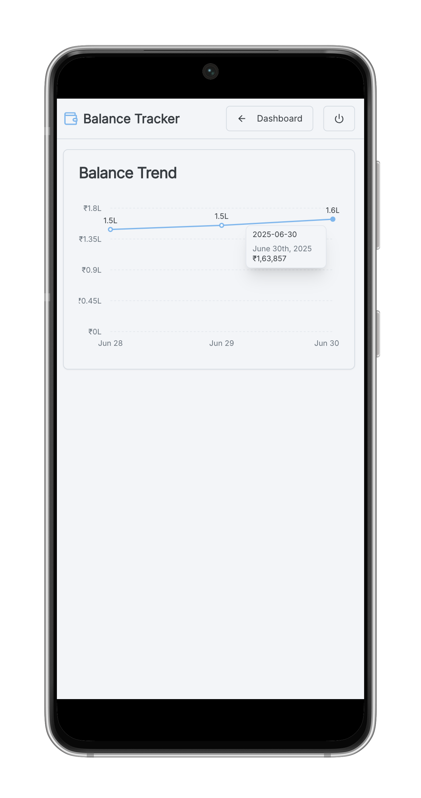

# Balance Tracker

[](https://github.com/itsluminous/BankrollTracker/actions/workflows/ci.yml)
[](https://vercel.com)
[](https://nextjs.org/)
[](https://www.typescriptlang.org/)

Balance Tracker is a modern, responsive web application designed to help you effortlessly manage and visualize your financial data. Track your bank account balances and fixed deposits with an intuitive interface and get insights from a trend graph.

Live app: [Balance Tracker](https://my-balance-tracker.vercel.app/)

[](https://vercel.com/new/clone?repository-url=https://github.com/itsluminous/BankrollTracker&env=NEXT_PUBLIC_SUPABASE_URL,NEXT_PUBLIC_SUPABASE_ANON_KEY,NEXT_PUBLIC_APP_URL)

## Screenshots

<p align="center">
  
  
  
  
</p>
<p align="center">
  
  
</p>

## Supabase Setup

This project uses Supabase for data storage and authentication. To set up your Supabase project:

1.  **Create a New Project**: Go to [Supabase](https://supabase.com/) and create a new project.
2.  **Get Project URL and Anon Key**: After creating your project, navigate to `Settings > API` to find your `Project URL` and `Anon Public` key.
3.  **Set up Database Schema**:
    *   Go to `SQL Editor` in your Supabase project.
    *   Create the `daily_records`, `accounts`, and `fixed_deposits` tables, and set up Row Level Security (RLS) policies by executing the SQL commands from the `DB_Setup.sql` file in this repository.
4.  **Enable Email Authentication**:
    *   Go to `Authentication > Providers`.
    *   Enable `Email` as an authentication provider.

## Environment Variables

You need to set the following environment variables for the application to connect to Supabase and for proper password reset redirects:

*   `NEXT_PUBLIC_SUPABASE_URL`: Your Supabase Project URL.
*   `NEXT_PUBLIC_SUPABASE_ANON_KEY`: Your Supabase Anon Public Key.
*   `NEXT_PUBLIC_APP_URL`: The public URL of your deployed application (e.g., `https://my-balance-tracker.vercel.app`). This is used for password reset email redirects.

For local development, create a `.env.local` file in the root of your project and add these variables:

```
NEXT_PUBLIC_SUPABASE_URL="YOUR_SUPABASE_PROJECT_URL"
NEXT_PUBLIC_SUPABASE_ANON_KEY="YOUR_SUPABASE_ANON_PUBLIC_KEY"
NEXT_PUBLIC_APP_URL="http://localhost:3000" # Or your local development URL
```

## Getting Started

To run the development server locally, use the following command in your terminal:
```bash
npm run dev
```
Open the local URL provided in the output (e.g., `http://localhost:3000`) in your browser to see the application.

## Testing

This project uses [Jest](https://jestjs.io/) and [React Testing Library](https://testing-library.com/docs/react-testing-library/intro/) for component testing. To run the tests, use the following command:

```bash
npm run test -- --coverage
```

## Linting and Type Checking

This project uses [ESLint](https://eslint.org/) for linting and [TypeScript](https://www.typescriptlang.org/) for type checking. To run the linter and type checker, use the following commands:

```bash
npm run lint
npm run typecheck
```

## Core Features

-   **Calendar View**: A clean calendar interface to select dates and see which days have recorded data at a glance.
-   **Trend Graph**: Visualize your total balance over time with a dynamic graph that automatically adjusts its granularity (daily, weekly, monthly) based on the available screen space.
-   **Daily View Layout**: A detailed daily view that displays account and Fixed Deposit (FD) details in collapsible, easy-to-read sections.
-   **Data Entry Form**: An intuitive form for entering your financial data. It comes pre-filled with the previous day's data to speed up entry and includes validation for matured FDs.
-   **Responsive Design**: A clean and modern UI that works seamlessly on both desktop and mobile devices.

## Tech Stack

-   **Framework**: [Next.js](https://nextjs.org/) (with App Router)
-   **UI**: [React](https://react.dev/), [ShadCN UI](https://ui.shadcn.com/), [Tailwind CSS](https://tailwindcss.com/)
-   **Charts**: [Recharts](https://recharts.org/)
-   **State Management**: React Hooks
-   **Data Storage**: [Supabase](https://supabase.com/) (PostgreSQL database with authentication and real-time capabilities).
-   **Testing**: [Jest](https://jestjs.io/), [React Testing Library](https://testing-library.com/)
